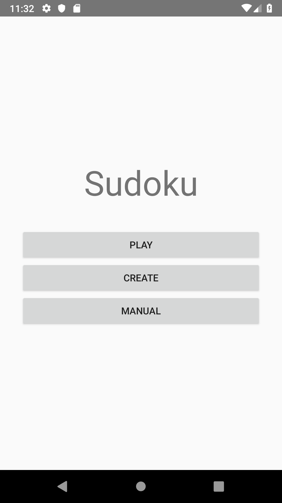
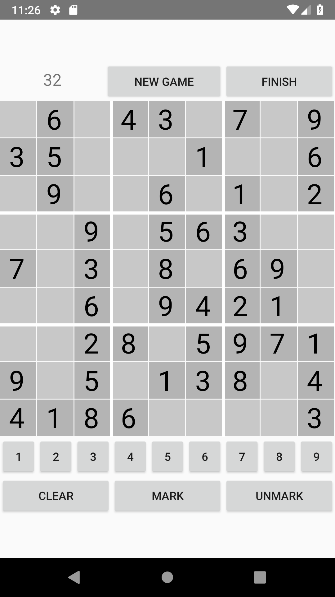
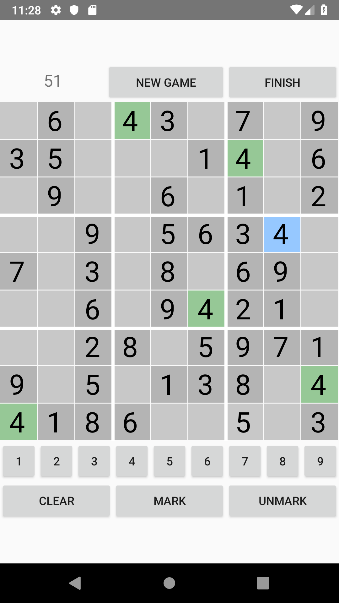
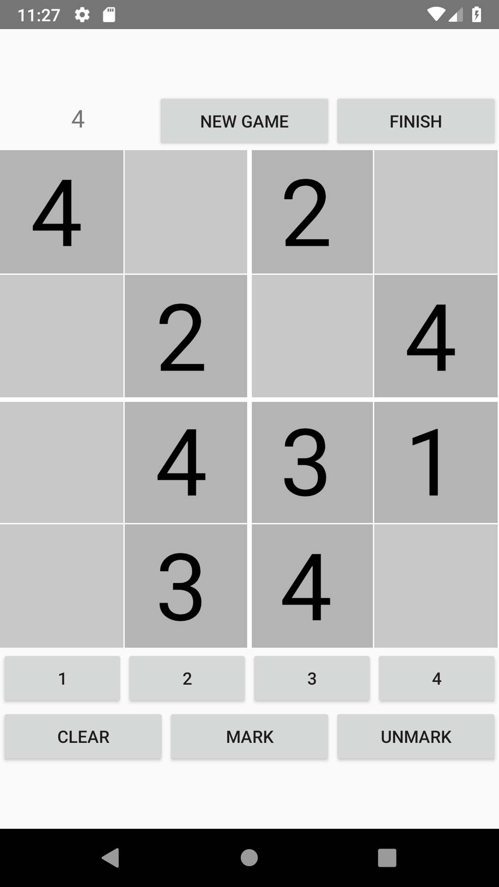
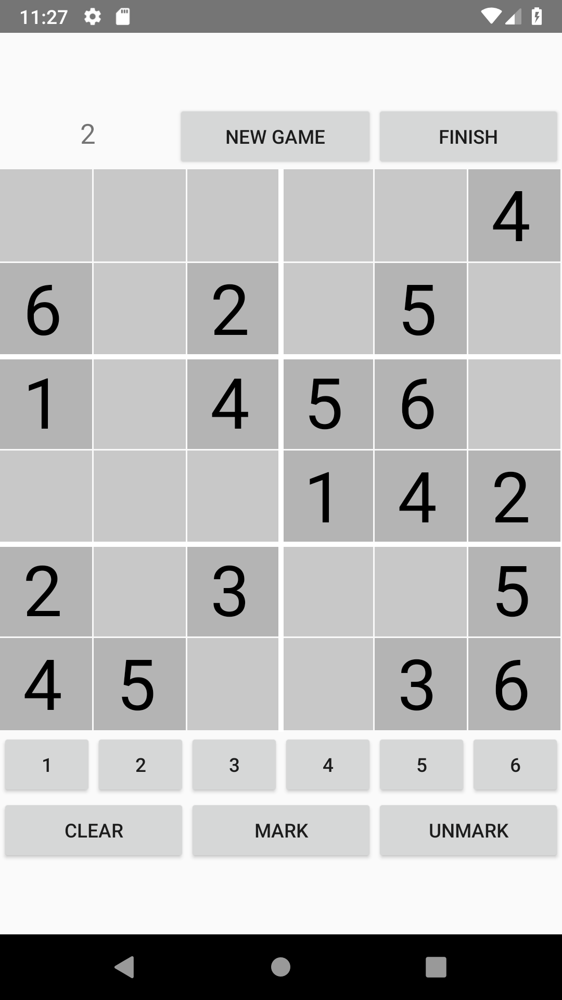

# Sudoku Android App
Sudoku app made using Android Studio.

  
  

## Features
- 3 puzzle sizes (4x4, 6x6, 9x9)
- Mark/unmark cell
- Selected cell number highlighting
- Create/save new puzzles
- A simple timer

  
  
  

